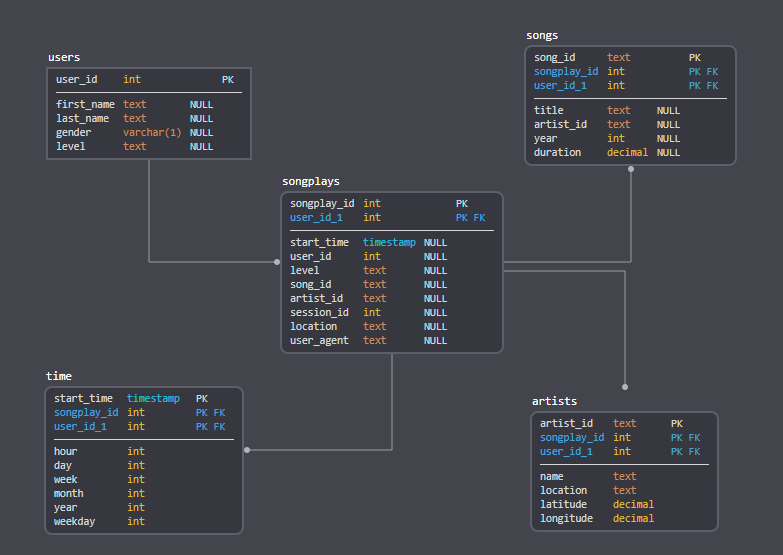

# Data Warehouse - Sparkify Redshift
***
Project Description
A music streaming startup called Sparkify would like to get more comprehensible meannings of its customers behavior. <br>
To achieve this goal Sparkify decided to move their growing user and song databases, as well as their ETL processes onto the cloud.<br>
Their raw data resides in S3, in a directory of JSON logs on user activity on the app (called events in this context), as well as a directory with JSON metadata on the songs available in their app.

This repository contains the code that get up Sparkify analytical infrastructure on AWS and moving its data from S3 to Redshift columnar tables transforms the data into the appropriate analytical formats.

In order, this exercise consists of below steps:
1. Create the Sparkify Data Warehouse infrastructure in AWS;
2. Create Redshift model: staging, fact and dimension tables (organizing the database in Star schema - suitable for analytical purposes);
3. ETL: Move S3 JSON events (logs) and songs Sparkify data to Redshift staging tables and populate fact and dimension tables using the data from staging tables creating the final OLAP Sparkify database. 

### 1. Infrastructure as code (IaC)
The AWS infrastructure used by Sparkify comprises of a Redshift datawarehouse where Sparkify OLAP database will rely on as well as the IAM role used to properly transfer the data from S3 to the DataWarehouse.<br>
To avoid having to access AWS console each time one need to create or delete (cost savings) those elements, the notebook ```DWH_IaC.ipynb``` contains the code that automates this infrastructre events, i.e., if you are going to execute this project repository, this notebook contains the first (create AWS infra) and the last (delete AWS infra) command you'll need to run.

### 2. Redshift DataWarehouse modeling
#### 2.1 Staging tables
Staging refers to a step in between, an intermediate state. It is known that data processing reading from files line by line is costly inneficient due to the I/O operation cost. Therefore, having a staging where one can simply bulk read the files using the powerful ```COPY``` command available in Redshift is very important. Such command reads an entire S3 dataset (pointing the root object address) into a compatible table. 

The staging tables must contain exact the same format as the JSON files being read from (read more on section 3 below) so that Redshift `COPY` can easily pass through all of the files and populate the tables accordingly.<br>
This compatibility between the JSON files in S3 and Redshift, in Sparkify case, is accomplished using below staging tables:

`stg_events`
- **artist**        text,
- **auth**          text,
- **firstName**     text,
- **gender**        varchar(1),
- **itemInSession** int,
- **lastName**      text,
- **length**        decimal,
- **level**         text,
- **location**      text,
- **method**        text,
- **page**          text,
- **registration**  bigint,
- **sessionId**     int,
- **song**          text,
- **status**        int,
- **ts**            timestamp,
- **userAgent**     text,
- **userId**        int

`stg_songs`
- **num_songs**        int,
- **artist_id**        text,
- **artist_latitude**  float,
- **artist_longitude** float
- **artist_location**  text
- **artist_name**      text,
- **song_id**          text,
- **title**            text,
- **duration**         decimal,
- **year**             int


#### 2.2 OLAP Datawarehouse tables
The Sparkify datawarehouse was modeled following a Star Schema (https://en.wikipedia.org/wiki/Star_schema) because it is a well-known denormalized easy to use database design schema for OLAP.
The star schema is simple and perfectly meets Sparkify needs.

**Fact table:**<br>
`songplays`<br>
- **songplay_id** SERIAL PRIMARY KEY
- **start_time**  timestamp sortkey
- **user_id**     int
- **level**       text
- **song_id**     text      distkey
- **artist_id**   text
- **session_id**  int 
- **location**    text
- **user_agent**  text

**Dimension tables:**<br>
`users`<br>
- **user_id**    int PRIMARY KEY
- **first_name** text
- **last_name**  text
- **gender**     varchar(1)
- **level**      text

`songs`<br>
- **song_id**   text PRIMARY KEY distkey
- **title**     text
- **artist_id** text
- **year**      int
- **duration**  decimal

`artists`<br>
- **artist_id** text PRIMARY KEY sortkey
- **name**      text
- **location**  text
- **latitude**  decimal 
- **longitude** decimal

`time`<br>
- **start_time** timestamp PRIMARY KEY sortkey
- **hour**       int
- **day**        int
- **week**       int
- **month**      int
- **year**       int
- **weekday**    int

Below is an image depicting the database tables and its relationships



##### 2.2.1 Table optimization
SQL statements in ```sql_queries.py``` describes the table formats, to optimize Redshift tables reading in the future it was organized thinking on how the information would be distributed among each Redshift node as well as how it would be sorted.
From the exercise statement: **"... analytics team ... find... insights in what songs their users are listening to..."** one may deduct that the relationship among users and songs will be heavy on database joins with the fact table.<br>
Even if all the people in the world decides to use Sparkify application the number of the songs would still potentially be bigger, therefore, the Datawarehouse chosen design was to make the `song_id` a distribution key for the datawarehouse and therefore Redshift nodes will keep similar `song_id` items in the same node to avoid further shuffling and optimize database readings.<br>
`songplays`<br>
- **song_id**     text      distkey

By the other hand, Redshift also takes benefit on readings if the data have some sorting schema, this needs to be well balanced because sorting costs too much on writing and therefore we must be very careful on choosing sorting keys. For Sparkify darawarehouse we choose the elements below as sorting keys and therefore the redshift will keep the tables sorted on below data like:

`songplays`<br>
- **start_time** timestamp sortkey

`artists`;<br>
- **artist_id** text sortkey

`time`<br>
- **start_time** timestamp sortkey

***
Sparkify Datawarehouse is created executing the python file ```create_tables.py```.<br>
This file was provided by the project template and it contains functions that:
1. Connects to the AWS Redshift database created using `DWH_IaC.ipynb` notebook and get a database cursor;
2. Drop the Sparkify Database if any so that we can run a fresh new project instance;
3. Create a new Sparkify Database;
4. Drop any existing table from Sparkify database using ```sql_queries.drop_table_queries[]``` statements;
6. Create Sparkify database tables ```stg_events, stg_songs, songplays, users, songs, artists, time``` using ```sql_queries.create_table_queries[]``` statements;
7. Close the database connection;


### 3. ETL - Extract, Transform and Load
The next step on this project execution, after calling `create_tables.py` is to execute `etl.py`.

#### 3.1 Staging tables

Given by the exercise description, the JSON files data looks like:

**Log data (events): s3://udacity-dend/log_data**:<br>
Contains logs collected on customer usage of Sparkify application.
Events were generated using the [eventsim](https://github.com/Interana/eventsim) project. Here is a sample of each row of **log_data**:
```
{"artist":null,"auth":"Logged In","firstName":"Walter","gender":"M","itemInSession":0,"lastName":"Frye","length":null,"level":"free","location":"San Francisco-Oakland-Hayward, CA","method":"GET","page":"Home","registration":1540919166796.0,"sessionId":38,"song":null,"status":200,"ts":1541105830796,"userAgent":"\"Mozilla\/5.0 (Macintosh; Intel Mac OS X 10_9_4) AppleWebKit\/537.36 (KHTML, like Gecko) Chrome\/36.0.1985.143 Safari\/537.36\"","userId":"39"}
```

**Song data: s3://udacity-dend/song_data**:<br>
Contains a JSON library of songs available on Sparkify. 
Subset of [Million Song Dataset](http://millionsongdataset.com/). Here is a sample of each row of **song_data**:
```
{"num_songs": 1, "artist_id": "ARKRRTF1187B9984DA", "artist_latitude": null, "artist_longitude": null, "artist_location": "", "artist_name": "Sonora Santanera", "song_id": "SOXVLOJ12AB0189215", "title": "Amor De Cabaret", "duration": 177.47546, "year": 0}
```

The tables described in section 2.1 were created to reflect this format.
`etl.py` connects to the database and executes the data loading from S3 to Redshift calling ```sql_queries.copy_table_queries[]``` that executes below `COPY` commands, responsible for all the data loading magic:

```
COPY stg_events
FROM 's3://udacity-dend/log_data' 
iam_role <ARN>
JSON 's3://udacity-dend/log_json_path.json'
timeformat 'epochmillisecs';
""").format(ARN)
```
*PS: above copy uses the JSON metadata description file `s3://udacity-dend/log_json_path.json` to describe the JSON files, it may be needed to make the reading easy for Redshift. In the case of `stg_songs` table it was not needed.*

```
COPY stg_songs
FROM 's3://udacity-dend/song_data' 
iam_role <ARN>
JSON 'auto';
```

#### 3.2 Consuming the data, transforming ant storing into the analytical tables
The next step in the ETL pipeline is to extract the relevant information from both `stg_events` and `stg_songs` staging tables and load it into the final OLAP tables.<br>
All this is done in ```etl.py``` calling `insert_tables` that iterating over  ```sql_queries.insert_table_queries[]``` selects the relevant data from the staging tables and sits it into the final OLAP tables.


## How to Run
***
1. Download the project;
2. Create an AWS account and clicking in the button "Add User" of https://console.aws.amazon.com/iam create a programatic access type user, **take not of the key and secret**;
3. Add the key and secret of the user created in step 2 to 
`[AWS_MANAGER]
KEY=<>
SECRET=<> `
into the file dwh.cfg; 
4. Install Jupiter locally (you can also use the Google Colab if prefer);
5. Execute the steps 1 ~ 5 of DWH_IaC.ipynb in a Jupiter instance;
6. Inside this project directory, in a shell run:  
    `python create_tables.py`
7. And then run:  
    `python etl.py`
8. (optional) You can test your database tables using the notebook DWH_tests.ipynb on a Jupiter instance;
9. Delete your AWS resources, Redshift costs money, running step 6 of DWH_IaC.ipynb;

## Project organization
***
```
project
│
└───data
│   └───star_schema - OLAP tables image description.
│   create_tables.py - Reset the sparkify database, dropping the database if it exists and creating a new one when executed.
│   DWH_IaC.ipynb - Jupiter notebook infrastructure as code, creates the Redshift and IAM elements used in this exercise.
│   DWH_tests.ipynb - Jupiter notebook used to test the database state.
│   dwh.cfg - Configuration file used throughout the project to consume global configurations.
│   etl.py - Extract information from S3 Sparkify files, load into the staging tables and then copy only the analytical relevant data into sparkify OLAP database.
│   README.md - This README file.
└───sql_queries.py - Contains all SQL queries used in this project.
```


