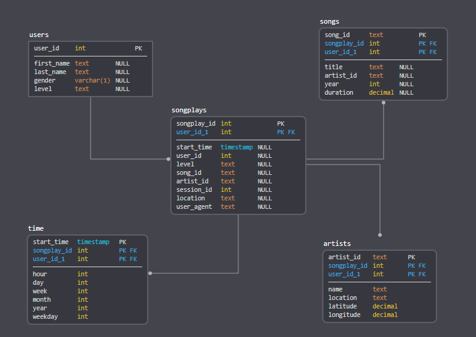

# Airflow Data Pipeline - Sparkify
***
Project Description
A music streaming startup called Sparkify would like to get more comprehensible meannings of its customers behavior. <br>
To achieve this goal Sparkify decided to move their growing user and song databases, as well as their ETL processes onto the cloud.<br>
Their raw data resides in an S3 bucket, inside two objects (similar to directories):  <br>
1. A directory of JSON logs on user activity inside the app (called events in this context)
2. A directory with JSON metadata describing the songs available in Sparkify app.

This repository contains the code that creates Sparkify analytical datawarehouse (Redshift) ETLing the data via an Airflow pipeline.

## 1. Pipeline design
### 1.1 DAG
Sparkify data pipeline DAG is described by the following image:


### 1.2 Staging steps
Staging refers to a step in between, an intermediate state. This step is responsible to extract Sparkify data from S3 buckets and create staging tables on Redshift.
These staging tables are very important in order to make the target OLAP datawarehouse computation easier, from stg to target tables instead of from S3 to target tables.

From the DAG picture, staging tables are created in the parallel tasks **Stage_events** and **Stage_songs**.

The data loaded from song and logs (events) S3 directories are structured in datawarehouse staging tables as:

`staging_events`
- **artist**        varchar(256),
- **auth**          varchar(256),
- **firstName**     varchar(256),
- **gender**        varchar(256),
- **itemInSession** int4,
- **lastName**      varchar(256),
- **length**        numeric(18,0),
- **level**         varchar(256),
- **location**      varchar(256),
- **method**        varchar(256),
- **page**          varchar(256),
- **registration**  numeric(18,0),
- **sessionId**     int4,
- **song**          varchar(256),
- **status**        int4,
- **ts**            int8,
- **userAgent**     varchar(256),
- **userId**        int4

`staging_songs`
- **num_songs**        int4,
- **artist_id**        varchar(256),
- **artist_latitude**  numeric(18,0),
- **artist_longitude** numeric(18,0)
- **artist_location**  varchar(256)
- **artist_name**      varchar(256),
- **song_id**          varchar(256),
- **title**            varchar(256),
- **duration**         numeric(18,0),
- **year**             int4


### 1.3 OLAP Star Schema datawarehouse
The Sparkify data lake was modeled following a Star Schema (https://en.wikipedia.org/wiki/Star_schema) because it is a well-known denormalized easy to use database design schema for OLAP.
The star schema is simple and perfectly meets Sparkify needs.



The fact table is created in the DAG task **Load_songplays_fact_table**.
Dimension tables are created in the parallel tasks **Load_user_dim_table**, **Load_artist_dim_table**, **Load_song_dim_table** and **Load_time_dim_table**.

### 1.4 Data quality checks
Last but not least, the data loaded into the datawarehouse is checked to check if it is fine, if everything goes well.
This is done simply by checking if there are records in the tables but many more checks could be done to guarantee the data integrity.

## 2. Note
From below picture you can see that for some reason the task **Stage_songs** is taking a long time to execute.
One could pay attention to it and investigate if some fine tunning could be possible.


## 3. How to Run
1. *Install Airflow locally.*<br>
Point the DAGs directory to this project DAG folder or copy `sparkify_dw_populate_dag.py` to the Airflow DAG folder.<br>
Same goes to the `plugins` folder content.<br>
2. *Redshift DataWarehouse*
Go to your AWS console, create the Redshift datawarehouse and execute the `airflow/create_tables.sql` to create the tables.<br>
3. *Configure Airflow*
Configure Airflow environment variables to use your AWS account as well as Redshift connection.


## 4. Project organization
```
project
│
└───airflow - root project folder
└──────dags - DAGs folder
|         sparkify_dw_populate_dag.py - The project DAG
└──────plugins - Airflow custom plugins folder
└─────────helpers - Utils folder
│             sql_queries.py - ETL queries.
└─────────operators - Airflow custom operators folder
│             data_quality.py - Data quality operator.
│             load_dimension.py - Dimension tables load operator.
│             load_fact.py - Fact table load operator.
│             stage_redshift.py - Staging tables load operator.
|      create_tables.sql - SQL statements used to create the datawarehouse tables
│      README.md - This README file.
```
