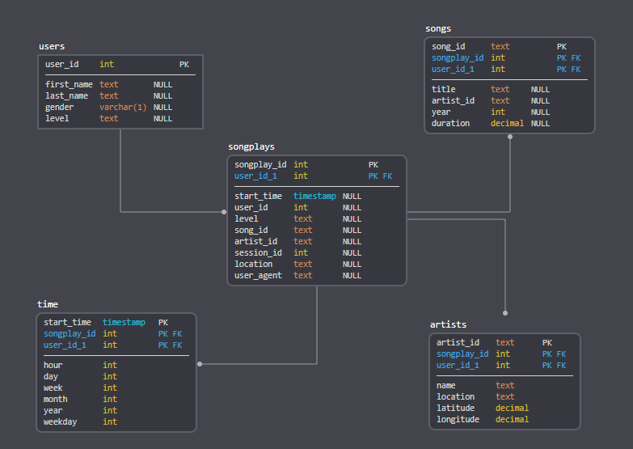

# Data Modeling - Sparkify Relational database
***
Sparkify is a startup company running a music streamming service.
The company would like to get more comprehensible meannings of its customers behavior and to achieve this goal Sparkify decided to build a Data pipeline to, ingesting log data from its product usage determine customer behavioral patterns.

This exercise consists of basically two steps:
1. Create the sparkify relational Database using PostgreSQL;
2. Consume two different **data sources**, transform the consumed data to meet Sparkify requirements and store the transformed data into the relational Database created above, this process is called ETL (extract, transform and load)

### 1. The Database
All SQL statements in ```sql_queries.py``` were written using the exercise database description requirements, it is very simple and contains basic tables creation, tables insert and tables drop SQL statements that are used along the project. This file contains also an ```inner join``` SELECT statement explained below that is useful to select data among two different tables during the ETL process.<br>
The Sparkify database was modeled following a Star Schema (https://en.wikipedia.org/wiki/Star_schema) because it is a well-known denormalized easy to use database design schema.
The star schema is simple and perfectly meets Sparkify needs.

#### Database organization description
**1. Fact table:**<br>
`songplays`<br>
- **songplay_id** SERIAL PRIMARY KEY
- **start_time** timestamp
- **user_id** int
- **level** text
- **song_id** text
- **artist_id** text
- **session_id** int 
- **location** text
- **user_agent** text

**2. Dimension tables:**<br>
`users`;<br>
- **user_id** int PRIMARY KEY
- **first_name** text
- **last_name** text
- **gender** varchar(1)
- **level** text

`songs`;<br>
- **song_id** text PRIMARY KEY
- **title** text
- **artist_id** text
- **year** int
- **duration** decimal

`artists`;<br>
- **artist_id** text PRIMARY KEY
- **name** text
- **location** text
- **latitude** decimal 
- **longitude** decimal

`time`<br>
- **start_time** timestamp PRIMARY KEY,
- **hour** int
- **day** int
- **week** int
- **month** int
- **year** int
- **weekday** int

Below is an image depicting the database tables and its relationships



#### Database creation
Once SQL statements were written in ```sql_queries.py```, Sparkify database could be easilly created executing the python file ```create_tables.py```.<br>
This file was provided by the project template and it contains functions that:
1. Connects to the PostgreSQL local default database, get a database cursor and turn on the autocommit database functionality;
2. Drop the Sparkify Database if any so that we can run a fresh new project instance;
3. Create a new Sparkify Database;
4. Drop the default database connection and connects to the new Sparkify Database getting a cursor and turning on its autocommit feature;
5. Drop any existing table from Sparkify database using ```sql_queries.drop_table_queries[]``` statements;
6. Create Sparkify database tables ```songplays, users, songs, artists, time``` using ```sql_queries.create_table_queries[]``` statements;
7. Close the database connection;


### 2. The ETL - Extract, Transform and Load
#### Data sources description
Sparkify application data is stored in JSON format.
The data sources are organized as:<br>

**1. data/log_data**:<br>
Contains logs collected on customer usage of Sparkify application.
Events were generated using the [eventsim](https://github.com/Interana/eventsim) project. Here is a sample of each row of **log_data**:
```
{"artist":null,"auth":"Logged In","firstName":"Walter","gender":"M","itemInSession":0,"lastName":"Frye","length":null,"level":"free","location":"San Francisco-Oakland-Hayward, CA","method":"GET","page":"Home","registration":1540919166796.0,"sessionId":38,"song":null,"status":200,"ts":1541105830796,"userAgent":"\"Mozilla\/5.0 (Macintosh; Intel Mac OS X 10_9_4) AppleWebKit\/537.36 (KHTML, like Gecko) Chrome\/36.0.1985.143 Safari\/537.36\"","userId":"39"}
```

**2. data/song_data**:<br>
Contains a JSON library of songs available on Sparkify. 
Subset of [Million Song Dataset](http://millionsongdataset.com/). Here is a sample of each row of **song_data**:
```
{"num_songs": 1, "artist_id": "ARKRRTF1187B9984DA", "artist_latitude": null, "artist_longitude": null, "artist_location": "", "artist_name": "Sonora Santanera", "song_id": "SOXVLOJ12AB0189215", "title": "Amor De Cabaret", "duration": 177.47546, "year": 0}
```


#### Consuming the data, transforming ant storing into the database
Given a created Sparkify database and using JSON Sparkify data (provided by the project template), the ETL pipeline is responsible to extract the relevant information from both `log_data` and `song_data` data sources, transform and load it into the database.<br>
All this is done in ```etl.py``` following below steps:
1. Connects to PostgreSQL database running locally and get a database cursor to run over;
2. Call the function **process_song_file()**
    1. Iterating over all **song_data** files, using the Python Pandas library 
        1. Get each file row columns: ``` song_id, title, artist_id, year, duration ```;
        2. Store above retrieved data into ```songs``` table;
        3. Get each file row columns: ``` artist_id, artist_name, artist_location, artist_latitude, artist_longitude ```;
        4. Store above retrieved data into ```artists``` table;
3. Call the function **process_log_file()**
    1. Iterating over all **log_data** files, using the Python Pandas library:
        1. Retrieve all file rows that represents a **NextSong** event, i.e., an event that means that the customer listened to the song identified on that row;
        2. Store all of these rows into the same Pandas DataFrame;
        2. From each **NextSong** row of the DataFrame:
            1. Get the ```timestamp``` column;
            2. Parse this timestamp using the Pandas function **to_datetime**;
            3. Using the converted timestamp element, get its ```hour, day, weekofyear, month, year, weekday``` information;
            4. Store above retrieved data into ```time``` table;
            5. Get ```userId, firstName, lastName, gender, level```;
            6. Store above retrieved data into ``` users``` table;
            7. On an inner join of tables ```songs``` and ```artists```, select **song_id** and **artist_id** given row song title, artist name and song duration;
            8. Combinining above retrieved data with row columns ```ts, userId, level, sessionId, location, userAgent```;
            9. Populate the table ```songplays```
            
<br><br>
## How to Run
***
1. Download the project;
2. Install in your local environment:  
    \- Python 3; <br>
    \- PostgreSQL database; 
3. Configure your environment variables to find the installed environment;
4. Start your PostgreSQL server;
5. Inside this project directory, in a shell run:  
    `python create_tables.py`
6. And then run:  
    `python etl.py`

## Project organization
***
```
project
│
└───data
│   └───log_data - Contains event logs on the Sparkfify application usage, each usage triggers a log that is stored in this folder.
│       │   ...
│   └───song_data - Contains an unstructured song catalog based on JSON files.
│       │   ...
│   create_tables.py - Reset the sparkify database, dropping the database if it exists and creating a new one when executed.
│   etl.ipynb - Jupiter notebook describing the development steps used to create the etl process.
│   etl.py - ETL process. Populates the sparkify database: extract information from the files in data folder, transform and load it into sparkify database.
│   README.md - This README file.
│   sql_queries.py - Contains all SQL queries used in this project.
└───test.ipynb - Jupiter notebook used to test if the steps taken during the development phase have been effective.
```


